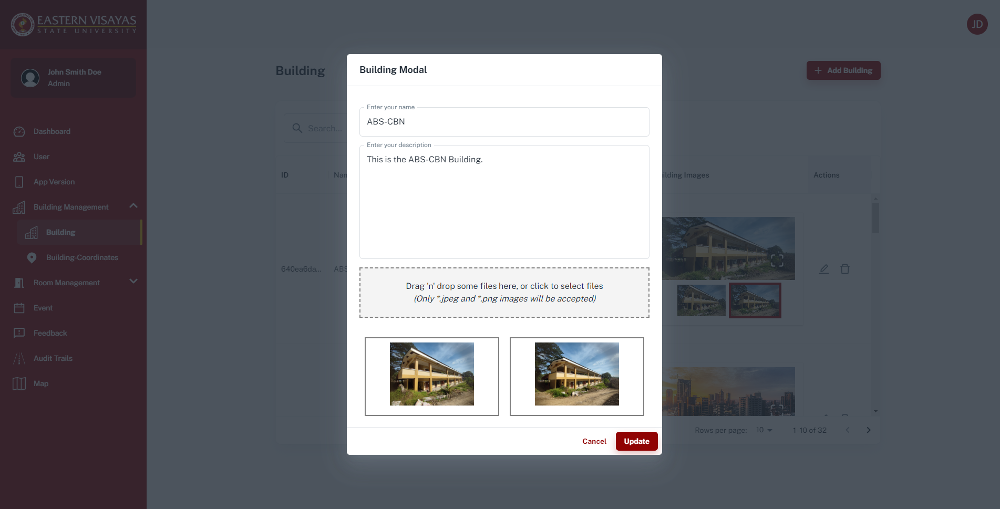
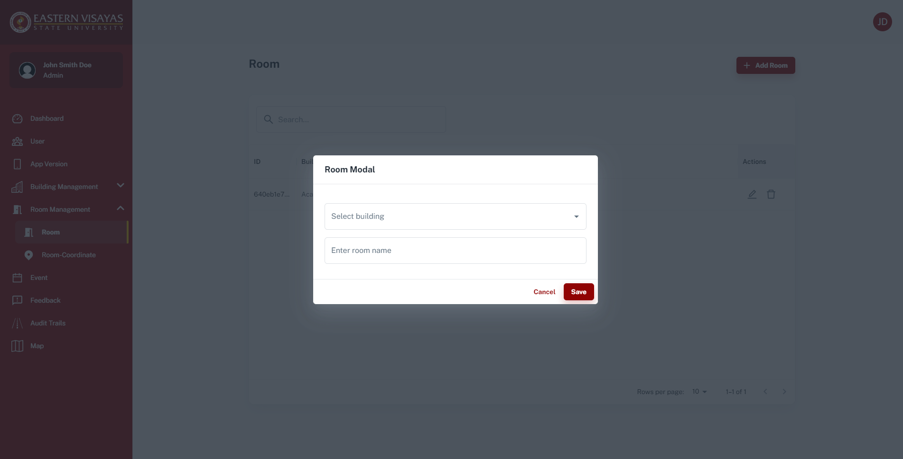
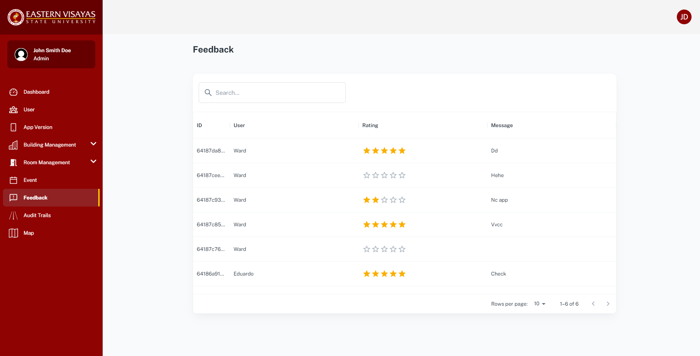

EVSU Emap

# Live Site = https://evsu-emap.vercel.app/

```
# Homes Page
```

   


```
# Login Page
```


```
# Dashboard Page
```


```
# Admins/Users Page
```


```
# Version Page
```


```
# Building Page
```





```
# Building Coordinate Page
```


```
# Room Page
```





```
# Room Coordinate Page
```


```
# Event Page
```


```
# Feedback Page
```



```
# Audit Trail Page
```


```
# Settings Page
```


